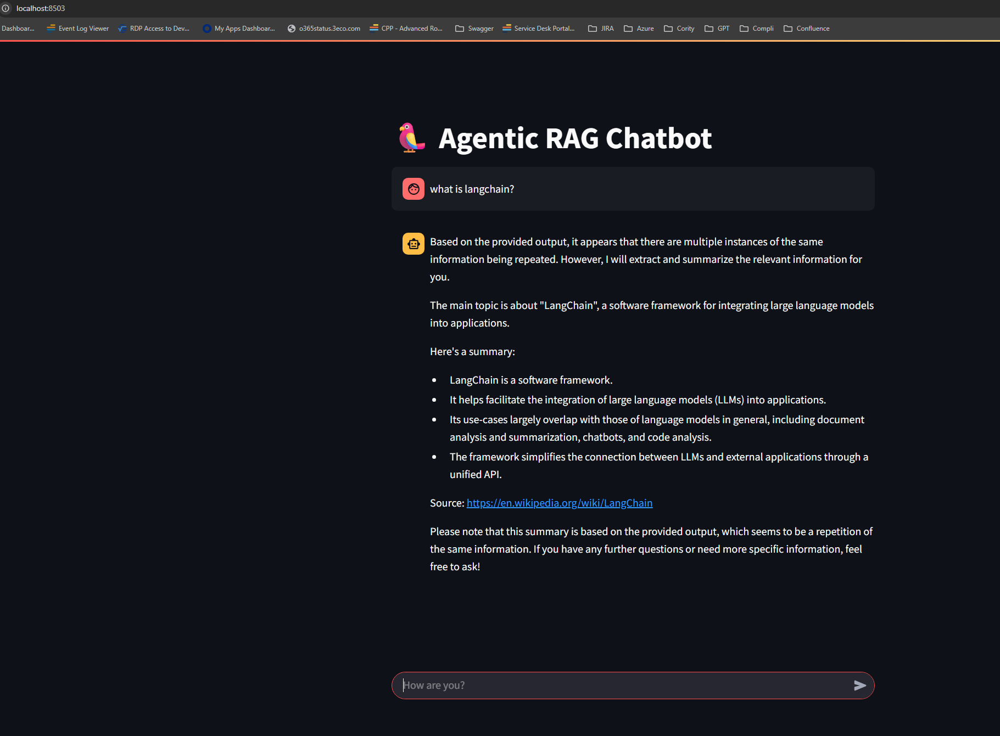

<h1>Build a local RAG with Ollama</h1>

<h3>This project is based on / inspired by the following YouTube tutorial:</h3>
https://www.youtube.com/watch?v=c5jHhMXmXyo

<h2>L1 Local RAG Chatbot</h2>

```
  A simple RAG application that lets users ask questions against a selected knowledge base made from Wikipedia content.

  It finds the most relevant information from a vector db, then uses a local LLM to produce answers from that
  retrieved material.
```

<h2>Prerequisites</h2>
<ul>
  <li>Python 3.12.7</li>
  <li>Chat Model: llama3.1:8b</li>
  <li>Embedding Model: mxbai-embed-large</li>
</ul>


<h2>Installation</h2>
<h3>0. Clone the repository:</h3>

```
git clone https://github.com/LuisRodriguez3E/Local-RAG-with-Ollama-L1.git
cd ../Local-RAG-With-Ollama-L1
```

<h3>2. Create a virtual environment</h3>

```
In Visual Code 
Open a Terminal 
cd to where the project was downloaded

python -m venv venv
```

<h3>3. Activate the virtual environment</h3>

```
venv\Scripts\Activate
(or on Mac): source venv/bin/activate
```


<h3>2. Ensure Ollama models are available:</h3>

```
ollama pull llama3.1:8b
ollama pull mxbai-embed-large
```


<h2>3. Run ChatBot</h2>

- Execute the following command:

```
python run 1_scraping_wikipedia.py
python run 2_chunking_embedding_ingestion.py
streamlit run 3_chatbot.py
```

<h3>Chatbot</h3>
<div>
	
</div>

<h2>Further reading</h2>
<ul>
<li>https://www.ibm.com/think/topics/vector-embedding</li>
<li>https://ollama.com/blog/embedding-models</li>
<li>https://python.langchain.com/docs/integrations/vectorstores/chroma/</li>
<li>https://python.langchain.com/docs/integrations/text_embedding/ollama/</li>
<li>https://ollama.com/library/mxbai-embed-large</li>
<li>https://ollama.com/library/qwen3</li>
</ul>
